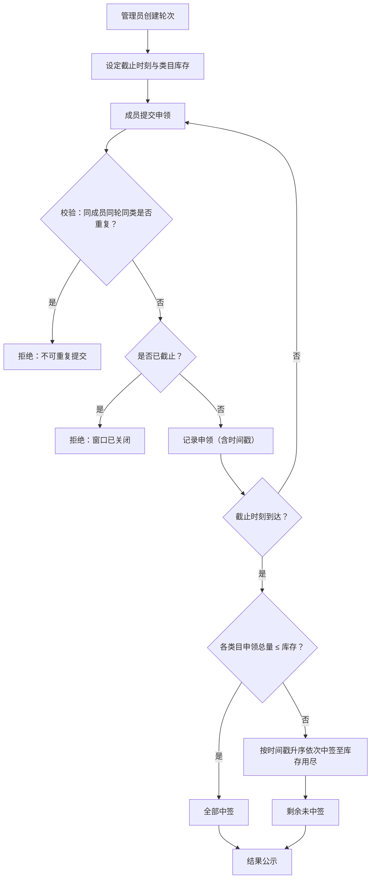

## 1. 产品概述

街区手作工坊共用材料柜申领系统——解决群喊话不公平的超额分配问题。管理员按轮次发布材料类目与库存上限，成员在线提交申领，截止后系统按时间戳公平抽签，结果透明可查。

- 核心痛点：群喊话先到先得不公平、超额申领无规则、分配结果不可追溯
- 目标用户：手作工坊管理员与成员，无需注册，通过成员代号即可参与

## 2. 核心功能

### 2.1 用户角色

| 角色 | 进入方式 | 核心权限 |
|------|----------|----------|
| 管理员 | 访问管理页面（无认证，信任制） | 创建/管理轮次、设定截止时刻与库存上限 |
| 成员 | 输入成员代号 | 提交申领、查看结果 |

### 2.2 功能模块

1. **首页**：轮次窗口概览、各类目已申领量/上限/是否超额、成员查询侧栏
2. **发布轮次页**：管理员设定窗口截止时刻、材料类目与各类库存上限
3. **申领页**：成员代号、类目选择、份额提交

### 2.3 页面详情

| 页面 | 模块 | 功能描述 |
|------|------|----------|
| 首页 | 轮次列表 | 展示所有轮次（进行中/已截止），点击展开类目详情 |
| 首页 | 类目状态卡片 | 每类目显示：已申领量 / 库存上限，超额标红预警 |
| 首页 | 成员查询侧栏 | 输入成员代号，列出当前轮次下该成员的所有提交及中签状态 |
| 发布轮次页 | 轮次信息表单 | 设定轮次名称、截止时刻（datetime picker） |
| 发布轮次页 | 类目库存设置 | 从 12 个内置类目中选择启用项，设定各类库存上限 |
| 申领页 | 申领表单 | 输入成员代号、选择 1 个类目、输入份额（1-5 整数） |
| 申领页 | 提交校验 | 同一成员同一轮同一类目只能提交 1 次；截止后不可提交 |

## 3. 核心流程

### 3.1 申领与抽签流程

1. 管理员创建轮次，设定截止时刻、启用类目及各类库存上限
2. 成员在截止前提交申领（成员代号 + 类目 + 份额）
3. 系统校验：同一成员同一轮同一类目不可重复提交
4. 截止时刻到达后，系统自动执行抽签：
   - 若某类目申领总量 ≤ 库存上限，则该类目所有提交均中签
   - 若超出，则按提交时间戳升序依次中签，直至分完库存，其余未中签
5. 成员可在首页查看中签结果

### 3.2 内置 12 类材料类目

木材、金属、布料、皮革、陶瓷、玻璃、纸张、颜料、线绳、粘合剂、工具、电子元件

## 4. 界面设计

### 4.1 设计风格

- **主色调**：暖木色（#8B6914）+ 奶油白（#FFF8E7），传递手工坊的温暖质感
- **辅助色**：深棕（#3E2723）用于文字，赭石红（#C75B39）用于超额预警
- **按钮风格**：圆角微阴影，主按钮暖木色填充，次按钮描边
- **字体**：标题用 "Playfair Display"，正文用 "Noto Sans SC"
- **布局**：左侧主内容区（轮次卡片网格），右侧固定侧栏（成员查询）
- **图标**：Lucide 图标库，木工/手工相关图标

### 4.2 页面设计概览

| 页面 | 模块 | UI 元素 |
|------|------|---------|
| 首页 | 轮次列表 | 卡片网格，每卡显示轮次名、截止时刻、状态标签（进行中/已截止） |
| 首页 | 类目状态 | 展开卡片后显示12类目网格，进度条展示已申领/上限，超额时进度条变红 |
| 首页 | 成员查询侧栏 | 右侧固定栏，输入框 + 结果列表（类目、份额、中签状态徽章） |
| 发布轮次页 | 轮次表单 | 居中表单卡，日期时间选择器，类目复选网格 + 库存数字输入 |
| 申领页 | 申领表单 | 居中简洁表单卡，代号输入、类目下拉、份额滑块/数字输入 |

### 4.3 响应式

- 桌面优先设计，侧栏在移动端折叠为底部抽屉
- 卡片网格在小屏下从多列变单列
- 表单在小屏下全宽显示

## 5. 技术约束

- 数据服务端持久化（SQLite）
- 截止判断与抽签以后端当前时刻为准
- Docker Compose 一键启动前后端
- 无需用户认证，管理员页面信任制
