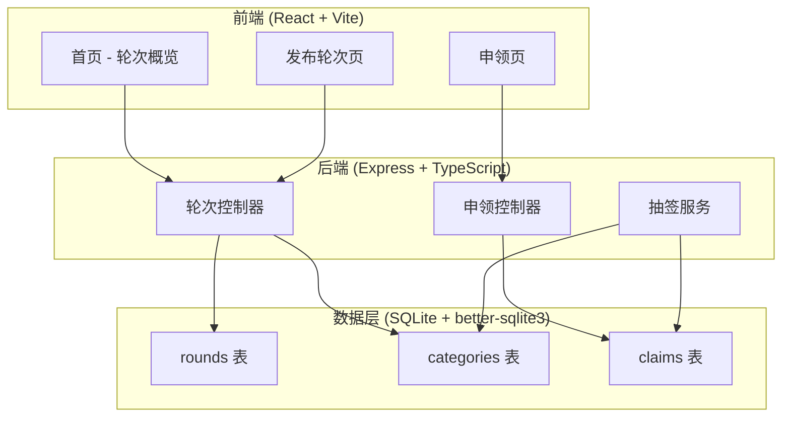
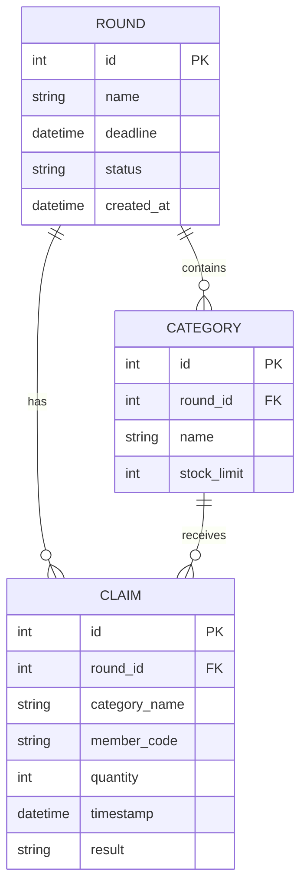

## 1. 架构设计



## 2. 技术说明

- **前端**：React@18 + TypeScript + Tailwind CSS@3 + Vite + Zustand
- **初始化工具**：vite-init（react-express-ts 模板）
- **后端**：Express@4 + TypeScript（ESM）
- **数据库**：SQLite（better-sqlite3），文件持久化于 `data/app.db`
- **Docker**：多阶段构建，Docker Compose 一键启动

## 3. 路由定义

### 前端路由

| 路由 | 用途 |
|------|------|
| `/` | 首页：轮次概览、类目状态、成员查询侧栏 |
| `/admin/rounds/new` | 管理员发布新轮次 |
| `/claim/:roundId` | 成员申领页 |

### 后端路由

| 方法 | 路由 | 用途 |
|------|------|------|
| GET | `/api/rounds` | 获取所有轮次列表 |
| GET | `/api/rounds/:id` | 获取轮次详情（含类目及申领统计） |
| POST | `/api/rounds` | 创建新轮次（含类目库存设置） |
| POST | `/api/rounds/:id/draw` | 手动触发抽签（可选，也可自动） |
| POST | `/api/claims` | 提交申领 |
| GET | `/api/claims/by-member/:roundId/:memberCode` | 查询成员在某轮的申领记录 |

## 4. API 定义

### 4.1 TypeScript 类型

```typescript
interface Round {
  id: number;
  name: string;
  deadline: string; // ISO 8601
  status: 'open' | 'closed' | 'drawn';
  createdAt: string;
}

interface Category {
  id: number;
  roundId: number;
  name: string;
  stockLimit: number;
  claimed: number; // 聚合字段
  isOverLimit: boolean; // 聚合字段
}

interface Claim {
  id: number;
  roundId: number;
  category: string;
  memberCode: string;
  quantity: number; // 1-5
  timestamp: string; // ISO 8601
  result: 'pending' | 'won' | 'lost'; // 抽签后更新
}

interface CreateRoundRequest {
  name: string;
  deadline: string;
  categories: { name: string; stockLimit: number }[];
}

interface CreateClaimRequest {
  roundId: number;
  memberCode: string;
  category: string;
  quantity: number;
}

interface MemberClaimsResponse {
  memberCode: string;
  claims: (Claim & { result: 'pending' | 'won' | 'lost' })[];
}
```

### 4.2 请求/响应示例

**POST /api/rounds**
```json
// Request
{
  "name": "2024年6月材料申领",
  "deadline": "2024-06-30T18:00:00Z",
  "categories": [
    { "name": "木材", "stockLimit": 20 },
    { "name": "金属", "stockLimit": 15 }
  ]
}
// Response: Round 对象
```

**POST /api/claims**
```json
// Request
{
  "roundId": 1,
  "memberCode": "A-1024",
  "category": "木材",
  "quantity": 3
}
// Response: Claim 对象
```

## 5. 服务端架构


- **Controller**：请求验证、HTTP 状态码
- **Service**：业务逻辑（抽签算法、重复校验、截止判断）
- **Repository**：数据库操作（CRUD）

## 6. 数据模型

### 6.1 ER 图



### 6.2 DDL

```sql
CREATE TABLE IF NOT EXISTS rounds (
  id INTEGER PRIMARY KEY AUTOINCREMENT,
  name TEXT NOT NULL,
  deadline TEXT NOT NULL,
  status TEXT NOT NULL DEFAULT 'open',
  created_at TEXT NOT NULL DEFAULT (datetime('now'))
);

CREATE TABLE IF NOT EXISTS categories (
  id INTEGER PRIMARY KEY AUTOINCREMENT,
  round_id INTEGER NOT NULL REFERENCES rounds(id),
  name TEXT NOT NULL,
  stock_limit INTEGER NOT NULL
);

CREATE TABLE IF NOT EXISTS claims (
  id INTEGER PRIMARY KEY AUTOINCREMENT,
  round_id INTEGER NOT NULL REFERENCES rounds(id),
  category_name TEXT NOT NULL,
  member_code TEXT NOT NULL,
  quantity INTEGER NOT NULL CHECK(quantity BETWEEN 1 AND 5),
  timestamp TEXT NOT NULL DEFAULT (datetime('now')),
  result TEXT NOT NULL DEFAULT 'pending',
  UNIQUE(round_id, category_name, member_code)
);

CREATE INDEX idx_claims_round_category ON claims(round_id, category_name);
CREATE INDEX idx_claims_member ON claims(round_id, member_code);
CREATE INDEX idx_claims_timestamp ON claims(round_id, category_name, timestamp);
```

## 7. Docker 配置

### Docker Compose

- 前端：Nginx 托管构建产物，反向代理 API 到后端
- 后端：Node.js 运行 Express，挂载 `./data` 卷持久化 SQLite
- 一条 `docker-compose up` 即可启动全部服务
